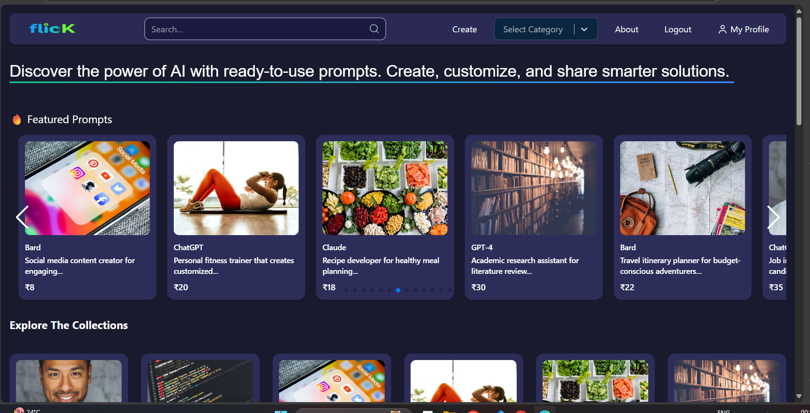
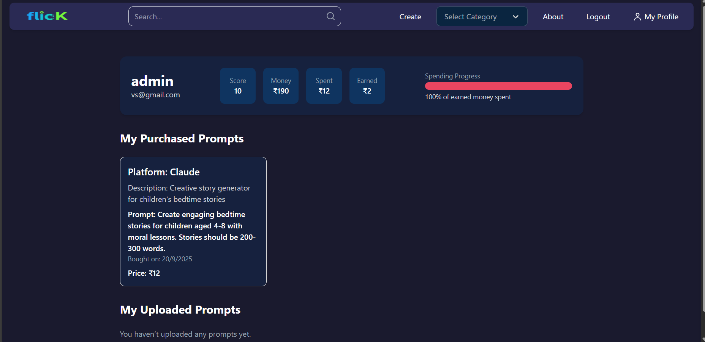
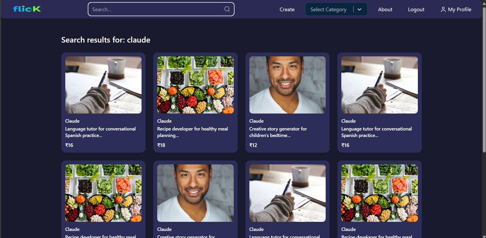
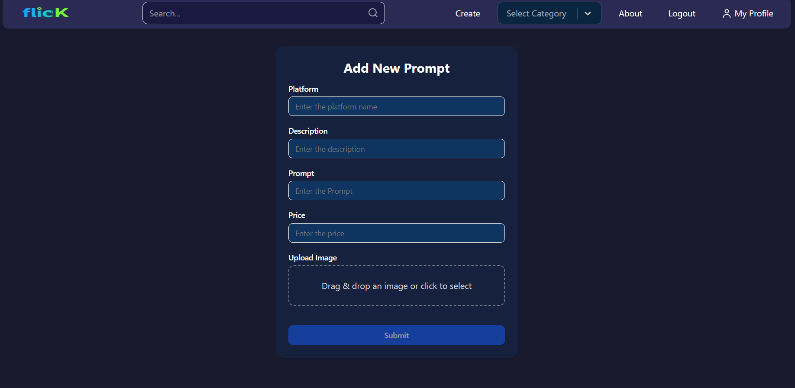
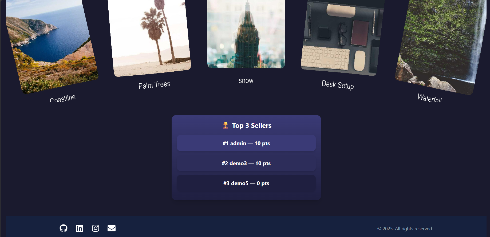

🌟 Promptflick

Promptflick is a MERN-based AI Prompt Marketplace where users can create, browse, and purchase prompts for platforms like ChatGPT, Gemini, MidJourney, Claude, and Stable Diffusion.

Authentication is powered by Passport.js + Express-Session for secure, session-based login.
Deployed using Vercel (Frontend) and Render (Backend) with MongoDB Atlas as the database.

Deployed using Vercel (frontend) and Render (backend).

🚀 Features

🔐 Authentication with Passport.js & Express-Session

🛒 Prompt Marketplace (create, explore, and purchase AI prompts)

📂 Category Filtering for different AI platforms

🔎 Search Functionality with query navigation

👤 User Dashboard (profile, purchases, and logout)

🎨 Modern Responsive UI (TailwindCSS + Framer Motion)

🌍 Full-stack Deployment with MongoDB Atlas, Render & Vercel

🛠️ Tech Stack

Frontend: React, TailwindCSS, Framer Motion, React Router
Backend: Node.js, Express.js, Passport.js, Express-Session
Database: MongoDB Atlas
Deployment: Vercel (Frontend), Render (Backend)

⚙️ Installation
1️⃣ Clone the Repository
git clone https://github.com/viveksingh62/Flick2.git

2️⃣ Setup Backend

cd Backend
npm install

Create a .env file in Backend/ and add:

GMAIL_USER=your_gmail_here
GMAIL_PASS=your_app_password_here
PORT=8080
CLOUD_NAME=your_cloudinary_name
CLOUD_API_KEY=your_cloudinary_api_key
CLOUD_API_SECRET=your_cloudinary_api_secret
ATLASDB_URL=your_mongodb_connection_string
NODE_ENV=development // for deploying change to production

Run backend:
node index.js

3️⃣ Setup Frontend
cd Frontend
npm install
Create a .env file in Frontend/ and add:
VITE_BACKEND_URL=http://localhost:8080

Run frontend:
npm run dev

🌍 Deployment

Frontend: Vercel

Backend: Render

Database: MongoDB Atlas

Update your frontend .env for production:

VITE_BACKEND_URL=https://promptflick.onrender.com

## 📸 Screenshots  

### 🏠 Homepage & 📊 Dashboard  

  
  

### 🔎 Search & ✍️ Create Prompt  

  
  

### 🏆 Leaderboard  

  

👨‍💻 Author

Developed by vivek singh ✨